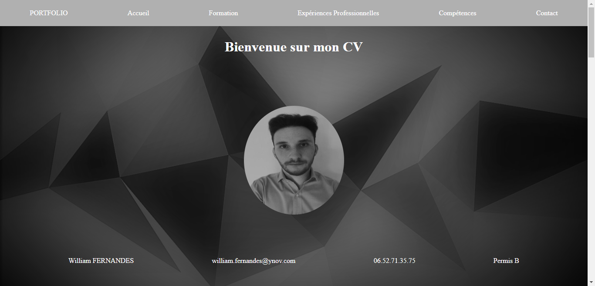

Projet Tech Web & BDD

C:\\Users\\Utilisateur\\OneDrive -
Ynov\\Images\\1200px-Definition_of_Free_Cultural_Works_logo_notext.svg.png

*I. Présentation du site web*
=============================

1. HTML/CSS
-----------

### a. Navbar

Avant la présentation, il faut savoir que mon portfolio à été réalisé à 90%
seulement avec de l’HTML/CSS. Ce langage est la base de construction d’un site
web.  
Pour commencer la présentation de ce portfolio, nous allons découvrir la Navbar
que j’ai réalisé ci-dessous.  
Celle-ci a une position fixe, c’est-à-dire qu’elle va nous suivre tout au long
du défilement du portfolio. Cette Navbar contient aussi une animation que l’on
observera plus en détail dans le prochain chapitre.

C:\\Users\\Utilisateur\\Pictures\\Screenpresso\\2019-06-30_16h27_13.png

Figure 1 Navbar portfolio

### b. Page d’accueil

Ensuite, nous allons regarder comment se compose la page d’accueil de mon site
web.

C:\\Users\\Utilisateur\\Pictures\\Screenpresso\\2019-06-30_16h37_39.png

Figure 2 Page d'accueil portfolio

Comme nous pouvons le voir, la page d’accueil reste très simple, avec une photo
basique en noir et blanc ainsi que les informations personnelles me concernant.
La Navbar est donc aussi présente et le restera tout au long de la présentation.  
Je précise qu’en cliquant sur les différents « onglets » de la Navbar, cela nous
dirige directement à la partie concernée.

### c. Formation

Nous allons maintenant observer la partie formation de portfolio.

C:\\Users\\Utilisateur\\Pictures\\Screenpresso\\2019-06-30_16h43_24.png

Figure 3 Diplôme obtenu et école actuelle

Comme nous pouvons le remarquer ici, cette partie reste aussi très basique. Elle
est composée d’un titre, d’un HR sous le titre ainsi que deux carrés beige
accompagnés de deux logos, contenant les informations relatives à mon parcours
scolaire.

### d. Expériences professionnelles & Timeline

Ensuite, nous verrons la partie Expériences professionnelles de mon site web qui
se compose en deux parties, une partie intégrée dans le site même qui fait
office de bouton, et l’autre partie, qui est une page à part, qui représente une
timeline de mes expériences professionnelles.

C:\\Users\\Utilisateur\\Pictures\\Screenpresso\\2019-06-30_16h47_01.png

Figure 4 Bouton menant à la Timeline

Nous pouvons donc voir que cette image ci-dessus contient un bouton (un gros
bouton pour être exact). Celui-ci reste encore dans le thème du site,
c’est-à-dire en nuances de gris et beige avec un logo et un petit texte inscrit
à l’intérieur.  
Nous ne le voyons pas très bien, mais la « pulsion » qui sort du cercle est une
animation qui permet à l’utilisateur de comprendre que ceci est un bouton ou du
moins un lien qui mène à une autre page.

C:\\Users\\Utilisateur\\Pictures\\Screenpresso\\2019-06-30_16h56_58.png

Figure 5 Timeline Expériences professionnelles

Pour commencer, nous ne pouvons pas voir entièrement la Timeline avec une
capture d’écran, mais l’aspect reste le même tout au long de celle-ci.  
Cette frise chronologique a pour but de représenter schématiquement mon parcours
professionnel tout en indiquant une petite précision sur chaque entreprise
fréquentées.  
Nous pouvons apercevoir un petit bouton « retour » en bas à gauche, celui-ci à
une position fixe, c’est-à-dire qu’il suivra l’utilisateur dans sa lecture sans
pour autant le déranger et permettra à celui-ci de retourner à mon site
principal quand il le souhaitera.  
Ce bouton contient un petit effet de zoom (1,1).

### e. Compétences

Ensuite, nous analyserons la partie compétence de mon site web qui regroupe la
majorité ou du moins les principales matières et langages que nous avons appris
tout au long de l’année.

C:\\Users\\Utilisateur\\Pictures\\Screenpresso\\2019-06-30_17h06_44.png

Figure 6 Compétences

Premièrement, nous voyons que la Navbar a très distinctement changer de couleur
depuis le début du site web (voir figure 3).  
Pour cette partie compétences, j’ai créé trois catégories bien distinctes les
unes des autres (Développement Web / Développement Logiciels / Infrastructures
et Systèmes Informations)  
Chaque catégorie dispose de quatre compétences ainsi que les logos appropriés à
chacune des matières.  
Comme nous le remarquons, les compétences dispose seulement d’un logo et non
d’une jauge, ceci est un choix de ma part, car j’ai jugé que les pourcentages
assimilés aux compétences ne représentent rien de concret (par exemple, 70% dans
le PHP ne permet pas de savoir les compétences réelles acquises).

### f. Contact et centres d’intérêts

Pour finir, nous allons étudier la dernière partie de mon site web qui se
compose d’un formulaire de contact et de mes centres d’intérêts.

C:\\Users\\Utilisateur\\Pictures\\Screenpresso\\2019-06-30_17h27_28.png

Figure 7 Formulaire de contact et centres d'intérêts

Nous remarquons donc deux parties, la première étant le formulaire, composé de
cinq parties, dont 4 à remplir par l’utilisateur. Le bouton « Envoyer » a
exactement la même animation que le bouton vu précédemment (voir figure 4) et
permet d’envoyer les informations marquées par l’utilisateur directement sur ma
boite mail.  
Les centres d’intérêts quant à eux, sont composés de passions et de hobbies que
j’ai exercé ou que j’exerce encore actuellement afin d’avoir quelques
informations complémentaires me concernant.  
J’ai représenté ces centres d’intérêts avec des logos afin d’obtenir quelque
chose de plus visuel.

2. Javascript
-------------

### a. Navbar JS

Nous avons donc vu tout ce qui concernait la base du site ainsi que le visuel,
nous allons donc maintenant passer dans les animations du site et plus
principalement de la Navbar.

C:\\Users\\Utilisateur\\Pictures\\Screenpresso\\2019-06-30_17h46_06.png

C:\\Users\\Utilisateur\\Pictures\\Screenpresso\\2019-06-30_17h46_52.png

C:\\Users\\Utilisateur\\Pictures\\Screenpresso\\2019-06-30_17h47_11.png

C:\\Users\\Utilisateur\\Pictures\\Screenpresso\\2019-06-30_17h47_34.png

C:\\Users\\Utilisateur\\Pictures\\Screenpresso\\2019-06-30_17h48_06.png

Sur les images ci-dessus, nous pouvons voir les différentes nuances de couleur
que j’ai décidé d’appliquer à ma Navbar.  
Celle-ci change de couleur à chaque partie de mon site web, nous pouvons donc
facilement deviner avec le plan à quelle couleur correspond chaque partie, mon
but étant de créer un dégradé de nuances de gris.

3. PHP
------

### a. Requête formulaire de contact

Pour finir cette présentation, nous allons voir le langage PHP que j’ai ajouté à
mon site web.  
Ce langage n’est pas visible sur le portfolio, cela agit en « arrière-plan ».

C:\\Users\\Utilisateur\\Pictures\\Screenpresso\\2019-06-30_17h57_16.png

Figure 8 Base de données PHPMyAdmin

Comme nous le remarquons, le message que j’ai écrit moi-même via mon site web
est stocké dans ma base de données  
Cela me permettra de récupérer les messages ainsi que les coordonnées des
utilisateurs qui voudront entrer en contact avec moi.

### b. Les requêtes pour les compétences

Le principe des requêtes pour les compétences de mon site web reste le même, la
seule différence présente est le fait d’afficher le contenu directement sur mon
portfolio.

C:\\Users\\Utilisateur\\Pictures\\Screenpresso\\2019-06-30_18h03_42.png

Figure 9 Requête PHP pour compétences

Le code étant trop long au vu des nombreuses compétences inscrites sur mon CV,
nous n’allons voir qu’une petite partie du code PHP.  
Comme nous le voyons ici, la connexion marche, mais je n’arrive pas à afficher
les compétences directement dans mon site web.

II. Ergonomie
-------------

C:\\Users\\Utilisateur\\Pictures\\Screenpresso\\2019-06-30_18h10_04.png

Figure 10 Maquette Adobe XD

Nous voyons maintenant la maquette que j’ai réalisé via Adobe XD. Il y a
quelques différences, voir beaucoup entre la maquette réalisée et le site web
réel.  
Pour commencer, la maquette comporte trois pages contre deux pour le site réel,
ceci est donc un gain de temps et permet à l’utilisateur une lecture plus
rapide.  
Comme nous pouvons le voir, la maquette comme le site comporte très peu de
texte, mis à part les expériences professionnelles car je me dois de les mettre
en avant. Peu de lecture permet à l’utilisateur de se lasser moins vite du CV et
ainsi avoir un regard plus visuel.  
J’ai privilégié les logos et images au texte car à trop grande proportion,
celui-ci encourage les utilisateurs à fuir le CV et à les perdre.  
Mon site web est donc principalement basé sur de la lecture rapide et du visuel,
ce qui permet à l’utilisateur d’aller très vite pour prendre les informations
importantes et de ne pas perdre le fil.

III. Référencement naturel
--------------------------

Pour finir cette présentation, nous allons lister les points du référencement
naturel que j’ai effectué pour réaliser mon site web.

-   **Performance d’affichage et la taille des images** : Les performances
    d’affichage caractérise la vitesse du site à charger complètement, les
    images étant le principal facteur de rapidité d’affichage d’un site web.  
    De ce point de vue, mon site ne comporte qu’une seule image « lourd » qui
    est ma photo de profil, le reste des images sont des logos, ce qui
    n’interfère que très peu la vitesse d’affichage de celui-ci.

-   **Le référencement off-page** : c’est à dire tout le travail qui consiste à
    créer des liens provenant de site références, réseaux sociaux, etc.., vers
    votre site internet.  
    Mon site ne comporte aucun lien de référence ni de réseaux sociaux.  
    Cela nuit à mon CV car je ne pourrais pas avoir de backlink se dirigeant
    vers mon site et donc cela veut dire moins de visibilité par les
    utilisateurs.

-   **Recherche lexicale afin d’améliorer le contenu** : Pour améliorer le
    référencement naturel, il faut rédiger un ensemble de mots-clés ou
    d’expressions se rapportant à mon thème.   
    Google juge la pertinence des articles et les titres des sites afin de
    donner un référencement par rapport aux autres sites du même thème.  
    Pour ma part, mon site comporte des titres de CV tels que « formation », par
    exemple, je n’ai aucun titre comportant le mot « projet », qui me
    permettrait de monter en référencement naturel.  
    A cause de mes expériences professionnelles majoritairement effectuées en
    usine, le mot « manutentionnaire » apparait plus de cinq fois dans mon site,
    or, je voudrais maintenant travailler dans l’informatique, donc ce mot est
    problématique et m’empêche d’avoir un bon référencement dans le domaine
    visé.

-   **Page d’accueil non textuel et soigné** : La page d’accueil et le titre ont
    pour but de donner envie aux utilisateurs de cliquer sur notre site, pour
    cela, le titre doit être accrocheur et la page d’accueil soigné afin de ne
    pas les perdre directement.  
    Mon titre de page d’accueil étant « Bienvenue sur mon CV », cela montre une
    marque de politesse dès le début et peut permettre aux utilisateurs de
    continuer à regarder mon site web.  
    Et enfin, ma page d’accueil est seulement constitué de mes informations
    personnelles obligatoires sur un CV, ce qui permet aux utilisateurs de ne
    pas passer beaucoup trop de temps sur celle-ci
